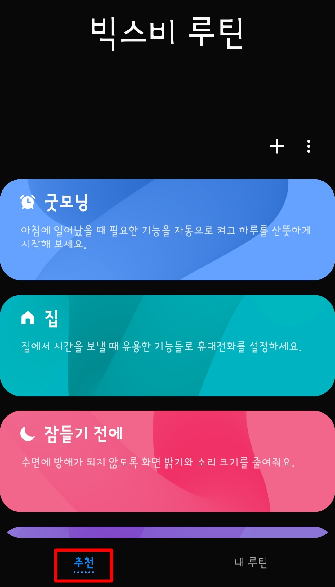
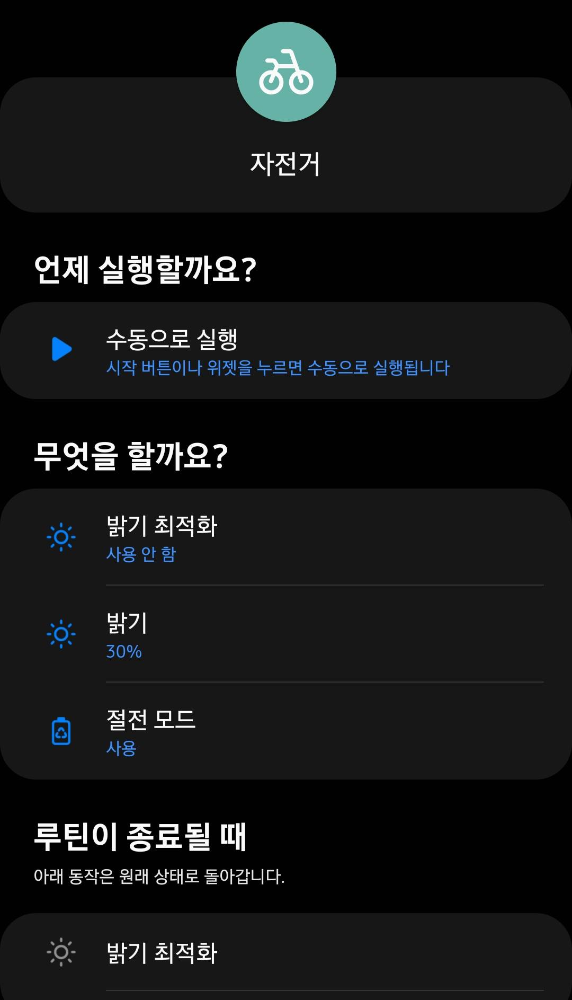
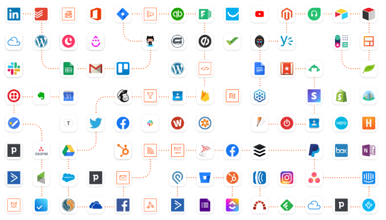
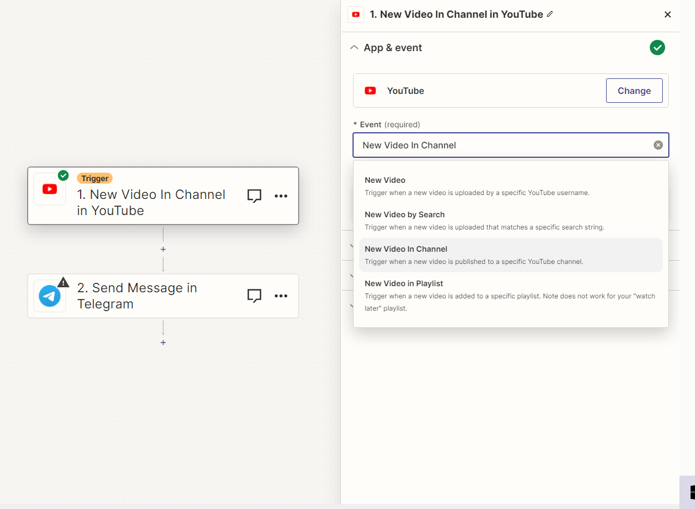

# Roouting: 데스크탑 루틴 빌더

> **_“빅스비 루틴을 웹에서 사용할 수 있다면 어떨까?”_**

|  |  |
| --------------------------------------- | ------------------------------------ |

### What We **Want: 개인용 업무 자동화 생산성 도구**

## Problem

- 일상 속에서 다양한 어플리케이션(웹사이트)에서 반복적인 작업을 효율적으로 수행하기 위해서는 업무 자동화가 필요. 소소하지만 귀찮고 리소스가 낭비되는 일.

(ex. 매일 수업 시작 전에 eTL&mySNU&노션&카카오톡&녹음기&etc…를 켜고 노션에 수업자료를 다운받아야 하는 대학생, 근로장학생이 교대될 때마다 각종 업무용 시스템을 로그아웃하고 다시 리로드해서 로그인해야 하는 학생처 사무실)

[칼퇴 혁명: 파이썬 없는 엑셀 업무 자동화로 효율 1000% 올리기](https://www.udemy.com/course/maso-ds-excel-onc41/?utm_source=adwords&utm_medium=udemyads&utm_campaign=Webindex_Catchall_la.KR_cc.KR&utm_term=_._ag_154831691911_._ad_667917181863_._kw__._de_c_._dm__._pl__._ti_dsa-1456167871416_._li_1009871_._pd__._&matchtype=&gad=1)

[사장님 몰래 하는 파이썬 업무자동화(부제 : 들키면 일 많아짐)](https://wikidocs.net/book/6353)

https://support.apple.com/ko-kr/guide/shortcuts-mac/apdf22b0444c/mac

- 파이썬 코드를 통한 일종의 매크로에 불과
- 특정 프로그램 내에서의 자동화에 국한

⇒ 이메일, 노션, SNS, eTL(학생) 등의 다양한 어플리케이션 간 연동을 지원하는 서비스의 부재

⇒ 코딩에 익숙하지 않은 일반인이 접근하기 쉽지 않음

---

## 현존 유사 서비스: Zapier

[일 잘하는 팀의 실전 '재피어(Zapier)' 활용법 - 업무용 협업툴 JANDI 블로그](https://blog.jandi.com/ko/2022/06/30/how-to-zapier-like-a-pro/)

- **Zap = Trigger + Action**

| Zap | Trigger                          | Action                           |
| --- | -------------------------------- | -------------------------------- |
| ex. | 페이스북 페이지 게시물 작성      | 같은 내용을 링크드인에 게시      |
|     | [채용]키워드가 포함된 Gmail 수신 | 메일 내용을 구글 드라이브에 저장 |
|     | 타 사용자가 구글 폼 제출         | 이메일 및 텔레그램으로 알림      |
|     | 스프레드시트에 고객 정보 기입    | 정해진 양식의 이메일이 발송      |
|     | 구글 캘린더에 일정 생성          | 스프레드시트에 형식에 맞춰 기입  |

- 그 외 여러 잽들을 섞을 수도, 트리거 및 액션을 복합적으로 설정할 수도 있음

But,

- 주로 해외 기업 CRM을 위한 툴
- 고객 관리에 중점, 국내 시장 앱(네이버, 카카오톡 등) 연동 부재

⇒ 마케팅, 고객 관리 등 비즈니스 기능을 잘 사용하지 않는 **국내 개인 사용자**를 타겟팅

⇒ 대학생(+직장인)들이 자주 사용하는 앱의 연동성에 보다 초점을 맞추기

---

## 목표 구현 기능

1. 이메일 수신, 커뮤니티 새 게시글, 슬랙 채널 메시지 등의 사용자 설정 이벤트 발생 시,
2. 구글 캘린더에 일정 등록, 노션 페이지에 첨부 파일 추가, 스프레드시트에 행 추가 등의 사용자 설정 이벤트 자동 실행
3. 사용자는 복잡한 코딩 과정 없이 GUI만으로 루틴 관리

---

### Sprint 1 : eTL → 카카오톡, 노션, Gmail (단순 프로그램 로딩)

특정 페이지에 접속 시 프로그램/웹사이트 다수 실행 루틴 커스텀

업무 환경 세팅(eTL 접속 시에 신문, 특정 사이트, 이메일, 내장 프로그램 -. 줌, 캡쳐 프로그램 등 실행)

보안 문제??? → 여러 가지 해결법(정보화본부에 메일보내기 등 보안 문제 정면돌파 / 좋은 경험이었다^^ / 메인 트리거 사이트 피봇팅)

### Sprint 2 : 다양한 액션 구현

- eTL 특정 과목 게시판에 새로운 게시글이 올라오면 → 해당 게시글의 첨부파일을 다운로드 후 노션 하위 페이지에 첨부

### Sprint 3 : eTL에서 다른 플랫폼으로의 확장

---

### Why This?

- 앱이 아니라 웹서비스 메인 (스마트폰으로 거의 모든 것을 할 수 있는 지금도 사람들이 여전히 PC로 하는 액션은 무엇일까?)
- 사용자가 직접 사용하고 피드백을 남길 수 있는 상용 서비스
- 구현 난이도와 복잡성
- +) 소셜 로그인, 알림, 크롤링, 서버 최신화, 보안 등등 다양한 경험 시도 가능

---

## 목표와 고려 사항

- 내년 2학기 소개원실 준비도…! 겸했으면 좋겠다 (물론 소개원실 안 들을 거라도 같이 하기 ㄱㄴ)
- 학기 중이니만큼 학교 공부보다 이 플젝이 우선시되진 않았으면 좋겠다. 겨울방학에 더 집중하더라도..! 학기 중엔 조금씩이라도 꾸준히 개발하면서 웹개발 감 잃지 않는 용도
- 그래도 주 n시간은 투입하기로 팀빌딩 후에 합의를 보고, 스프린트 진도를 조정해가더라도 아예 던져버리진 않기
- Jira, Trello나 Confluence등의 툴을 사용하여 스프린트 관리하는 것도 같이 연습하자!

---

## 필요 기술

1. 다양한 소셜 로그인 연동
2. 설정한 이벤트 탐지 및 확인(api, 크롤링)
3. 이메일 및 메시지 전송 등 알림 서비스 구현

---

## 예상 문제

1. 다양한 서비스를 연동하는 과정에서 발생하는 접근 권한 오류
2. 크롤링 과정의 서버 부하 및 딜레이
3. 자원 부족으로 인한 연동 가능 서비스 수의 한계
4. eTL 말고 다른 서비스로 확장이 가능할까?
5. 연쇄 부팅을 구현하는 것이 가능하다고 했을 때, 더 심화된 기능까지 구현 가능할까? (ex. 이미지 갖다넣기)
